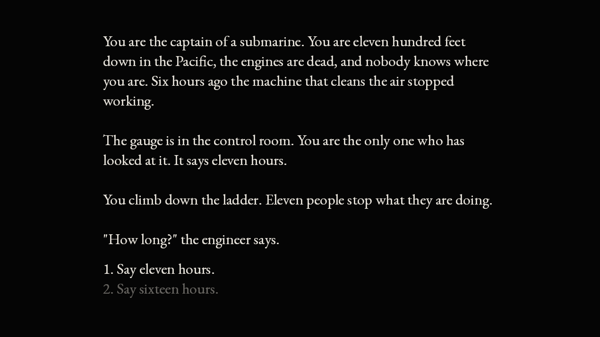

# Submarine Fun

Author: Haoran Xie

Design: You are the captain of a submarine stuck on the sea floor with dead
engines and eleven hours of air. You never choose what to do, only what your
crew members are told, and they act on whatever you tell them.

Text Drawing: All text is shaped and rasterized at runtime. At startup
`TextRenderer` opens the font with freetype and wraps that same `FT_Face` in a
harfbuzz font, so the two libraries agree on glyph indices. When a line is
needed, harfbuzz shapes the UTF-8 string into glyph indices and 26.6 fixed-point
positions. Any glyph index the shaper returns that is not already in the atlas
gets rendered by freetype at that moment and copied into a single 1024x1024
single-channel texture, row by row because `FT_Bitmap::pitch` is not always the
row width. The atlas is keyed by glyph index, so it ends up holding one copy of
each distinct glyph the font can draw, and its size depends on the font rather
than on how much text exists. Drawing appends one textured quad per glyph into a
shared vertex buffer, and the whole frame goes out in one `glDrawArrays` call
against `ColorTextureProgram`. Nothing allocates a texture or a GL object per
line, and shaping happens when a screen changes or the window resizes, never per
frame. The glyph size comes from whichever window dimension is the tighter
constraint, then shrinks until the longest screen in the story fits, so the
reading column holds about the same number of words on any monitor. Changing the
window rebuilds the atlas at the new size, because a glyph is hinted for one
specific size and scaling it looks soft.

Choices: The story is authored in `assets/story.txt`, a line-based format where
`:: name` starts a node, `> label -> target` adds a choice, and anything else is
prose. `pack-story` turns that into `dist/story.chunk`, which holds one character
blob, an array of nodes, and an array of choices. Nodes and choices point at
spans of the blob by byte offset, and choices point at target nodes by index, so
the game never parses text at runtime. It reads three arrays and follows
indices. The packer resolves every node name to an index and refuses to write
the file if a choice points somewhere that does not exist, naming the node that
carries it. `pack-story` is run by hand and `dist/story.chunk` is committed, so
building the game never depends on running the tool.

Screen Shot:

How To Play:

Read the screen, then pick what to tell the crew. Press the number key next to
an option, or move with the arrow keys and press enter. An ending offers a
single option that starts the story over.

You cannot act directly. Every choice is something you say, and the crew acts on
what it believes, which is what decides the ending you get.

Sources: The font is [EB Garamond](https://fonts.google.com/specimen/EB+Garamond)
by Georg Duffner and Octavio Pardo, used under the SIL Open Font License 1.1.
The font file ships as `dist/EBGaramond-Regular.ttf` and its license text is in
`dist/OFL-EBGaramond.txt`. All prose and all code are mine.

Credits: Text shaping follows the harfbuzz tutorial at
https://github.com/harfbuzz/harfbuzz-tutorial/blob/master/hello-harfbuzz-freetype.c
and freetype setup follows the freetype tutorial at
https://www.freetype.org/freetype2/docs/tutorial/step1.html . The single-channel
atlas relies on texture swizzling and unpack alignment as described at
https://www.khronos.org/opengl/wiki/Texture#Swizzle_mask and
https://www.khronos.org/opengl/wiki/Pixel_Transfer#Pixel_layout . Colors are
converted to linear before being handed to the shader because `main.cpp` enables
`GL_FRAMEBUFFER_SRGB`, following
https://en.wikipedia.org/wiki/SRGB . `Story` and `pack-story` use
`read_write_chunk.hpp` from the base4 code, and `PlayMode` keeps the `Load<>`
and `draw()` scaffolding from the `PlayMode.cpp` that ships with base4. Each of
these is also cited inline at the point of use.

This game was built with [NEST](NEST.md).
